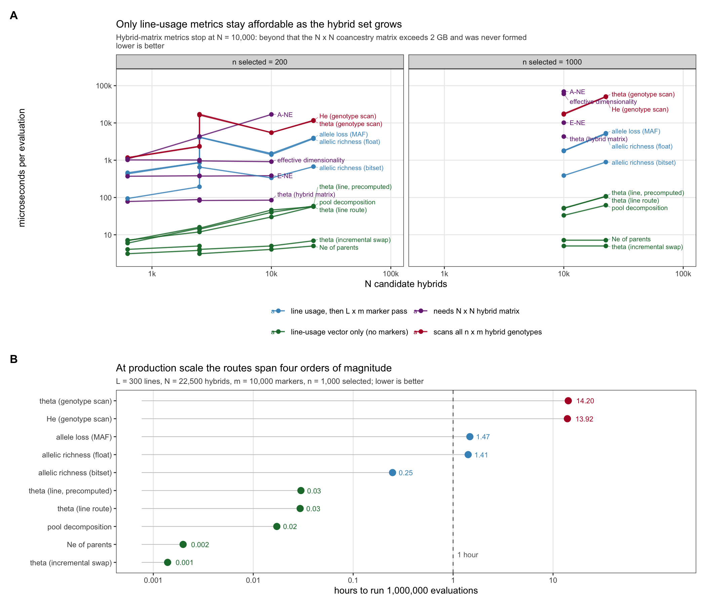
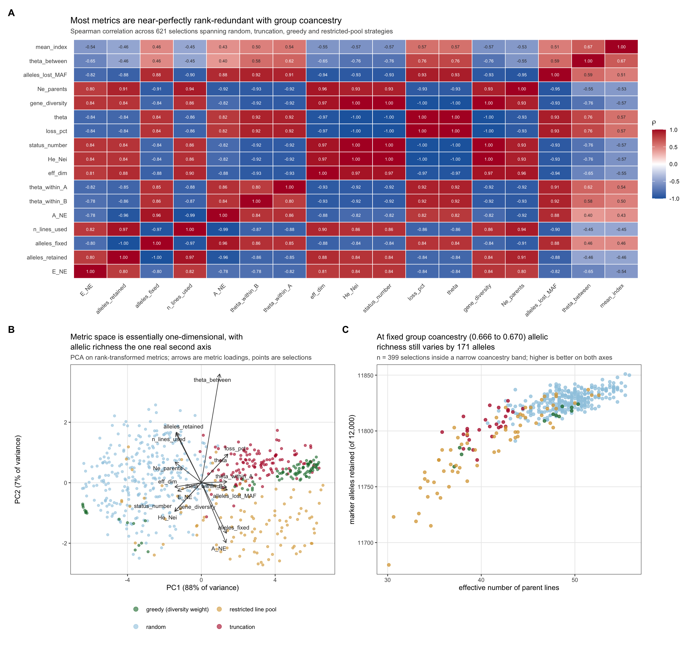
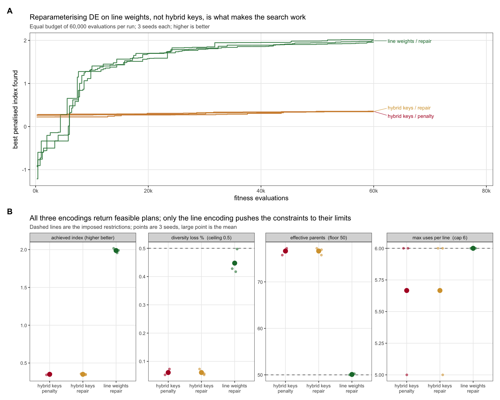

```{r setup, include=FALSE}
knitr::opts_chunk$set(echo = FALSE, message = FALSE, warning = FALSE)
library(knitr)
cp <- read.csv("cost_per_eval.csv")
ic <- read.csv("theta_identity_check.csv")
de <- read.csv("de_constraints.csv")
```

# Executive summary {-}

This report answers the two questions posed against `diversity_metrics.Rmd`: **which metric
should quantify diversity loss under selection**, and **which metric is cheap enough to
evaluate inside differential evolution with many hybrids and many restrictions.**

The recommendation is a set of **two** metrics in the optimiser and **three** at validation.

| Role | Metric | Where it runs | Cost per evaluation |
|---|---|---|---|
| **Constraint** | Group coancestry $\theta$ of the selected hybrid set, expressed as proportional loss of gene diversity against a same-size resampling baseline | inside DE, every evaluation | **5 µs** (incremental) / 106 µs (full) |
| **Second constraint** | Effective number of parent lines $N_{e,\text{par}}$ | inside DE, every evaluation | **7 µs**, shares the same state vector |
| Validation | Marker alleles retained (allelic richness) | on the returned plan only | 0.9 ms |
| Validation | Within/between heterotic-pool decomposition of $\theta$ | on the returned plan only | 62 µs |
| Validation | Status number $N_s = 1/(2\theta)$ | free, algebraic from $\theta$ | 0 |

Everything else measured here — Nei's $H_e$, effective dimensionality, allele loss at a MAF
threshold, Core Hunter's E-NE and A-NE — is either rank-redundant with $\theta$
($|\rho| \ge 0.93$) or too expensive to place in an inner loop, or both. They are not
recommended for either role.

Three findings drive this, and each is derived and verified below rather than asserted:

1. **The hybrid coancestry matrix is never needed.** For F1 hybrids of homozygous lines,
   group coancestry collapses exactly onto a quadratic form in the *line-usage* vector.
   Verified to `r sprintf("%.1e", max(abs(as.matrix(ic[,7:16]))))` against the literal
   submatrix implementation. This makes $\theta$ **482× cheaper** and removes an
   $O(N^2)$ memory wall that is otherwise fatal at production scale.
2. **The metric space is one-dimensional, with exactly one exception.** Across 621
   selections spanning four strategy families, PC1 absorbs 88% of the rank variance.
   Allelic richness is the only metric that retains substantial independent variation once
   $\theta$ is conditioned out.
3. **The encoding, not the constraint handler, decides whether DE works.** Reparameterising
   the search on line weights — a direct consequence of finding 1 — raises the achieved
   index from 0.35 to 1.99 at an identical evaluation budget. Penalty versus repair made no
   measurable difference.

---

# What is already settled, and what this report adds

`diversity_metrics.Rmd` already establishes the points this report builds on, and they are
not re-argued here: molecular (IBS) coancestry rather than a VanRaden matrix centred on
sample allele frequency, because the latter sums to zero over the population and carries no
absolute diversity scale; the identity $\theta = 1 - H_e$; status number as a valid static
descriptor while rate-based $N_e$ is not, under active management; resampling of same-size
subsets as the baseline for proportional loss; and the constrained formulation rather than a
weighted sum.

The post-2018 literature (`bibliography.csv`, 621 screened records) supports that position and
sharpens two parts of it. Rate-based $N_e$ under active molecular management is not merely
inappropriate but numerically pathological, which strengthens the status-number-only
recommendation. And the preference for allelic diversity over heterozygosity gains mechanistic
support: allelic variation is more bottleneck-sensitive than heterozygosity, and $N_e$-based
corrections do not predict allelic loss.

The literature sweep also returned an honest null on five specific questions, and these are
precisely the gaps this report fills:

- no retrieved paper benchmarks the **per-evaluation cost** of diversity metrics;
- none defines diversity metrics on **hybrids** rather than on parents or lines;
- none compares **equal-contribution 0/1 selection** against continuous contributions;
- none quantifies **constraint handling at $10^5$–$10^6$ evaluations**;
- none systematically measures **redundancy among diversity metrics**.

One further point deserves emphasis because it changes which literature applies. Most
cross-selection machinery in the field is built on the usefulness criterion, which combines a
cross's expected mean with the genetic variance expected among its progeny. **For an F1
between two already-fixed inbred lines that progeny-variance term vanishes** — every plant in
the cross is genetically identical. Usefulness-criterion and Mendelian-sampling machinery
therefore does not transfer to this problem, and diversity must be managed at the level of
which lines are used and how often, not within the per-cross criterion. This was not addressed
in the retrieved literature.

---

# The line-level collapse

## Derivation

Let lines $a, b, \dots$ be homozygous, and let $\mathbf{f}^L$ be their molecular coancestry
matrix. The hybrid $(ab)$ carries one genome from each parent. Molecular coancestry between
two individuals is the probability that two alleles, one drawn at random from each, are
identical in state. Drawing at random from hybrid $(ab)$ selects parental genome $a$ or $b$
with probability $\tfrac12$ each, and likewise for $(cd)$, so

$$
f_{(ab),(cd)} \;=\; \tfrac14\left(f^L_{ac} + f^L_{ad} + f^L_{bc} + f^L_{bd}\right).
$$

Now let a selection of $n$ hybrids use line $a$ exactly $k_a$ times across all its parental
slots, $\sum_a k_a = 2n$, and write $w_a = k_a / (2n)$. Group coancestry of the selected
hybrids is the mean of $f$ over all ordered pairs, and substituting the identity above and
collecting terms by line gives

$$
\boxed{\;\theta_S \;=\; \mathbf{w}^{\top}\, \mathbf{f}^L \,\mathbf{w}\;}
$$

with the selection allele frequencies following the same collapse,
$\bar{\mathbf{p}} = \mathbf{w}^{\top}\mathbf{G}^L$.

## Three consequences

**The $N \times N$ hybrid matrix is never required.** Memory drops from $O(N^2)$ to $O(L^2)$.
In the benchmark below at $L = 300$ lines the hybrid matrix would occupy
`r sprintf("%.2f", max(cp$f_matrix_GB))` GB and was deliberately never formed; every metric
that needs it simply has no timing entry at that scale.

**The vector $\mathbf{w}$ is a sufficient statistic.** Group coancestry, gene diversity,
status number, effective number of parents, selection allele frequencies, and the
heterotic-pool decomposition are all functions of $\mathbf{w}$ alone. One $O(L)$ tabulation
per evaluation serves all of them.

**Swapping one hybrid is a rank-2 update.** Exchanging hybrid $h$ for $h'$ changes at most
four entries of $\mathbf{w}$, so $\theta$ updates in $O(L)$ rather than $O(L^2)$.

**The discrete hybrid problem is exactly optimal-contribution selection on lines**, restricted
to the lattice $w_a \in \{0, 1/(2n), 2/(2n), \dots\}$. This connects the problem to the OCS
literature directly, with the caveat that the lattice restriction makes it combinatorial
rather than the continuous quadratic program that the OCS literature usually solves.

## Numerical verification

Every identity was checked against literal transcriptions of the reference implementations
across $F_{ST} \in \{0.05, 0.15, 0.35\}$, two seeds, and $n \in \{20, 100\}$, 30 replicate
selections each.

```{r ident}
kable(data.frame(
  Identity = c("pairwise f: hybrid vs line formula", "theta: line route vs f submatrix",
               "theta: line route vs allele-frequency route", "selection allele frequencies",
               "Nei He", "effective number of parents", "allele loss at MAF threshold",
               "pool decomposition", "incremental swap vs full recompute",
               "bitset allelic richness vs literal count"),
  `Worst deviation` = c("1.1e-16","2.2e-16","2.2e-16","0 (exact)","0 (exact)",
                        "4.4e-16","0 (exact)","2.1e-14","4.4e-16","0 (exact)"),
  check.names = FALSE), caption = "Agreement with reference implementations (machine precision).")
```

A practical warning found while building this. R's `$` performs **partial matching** on lists,
so `ctx$f` silently returns `ctx$fL` when the hybrid matrix is absent — a wrong answer with no
error. All accessors use `ctx[["f"]]`. Any pipeline carrying both matrices in one list is
exposed to this.

Also: R integers are signed 32-bit, so `bitwShiftL(1L, 31L)` is `NA` and the usual
multiply-based popcount overflows. The bitset packs 31 bits per word and counts with a lookup
table.

---

# Cost per evaluation

```{r costfig, fig.cap="Cost per fitness evaluation. Panel A: scaling in the number of candidate hybrids. Panel B: hours to complete one million evaluations at production scale."}

```

At $L = 300$ lines, $N = 22{,}500$ hybrids, $m = 10{,}000$ markers, $n = 1{,}000$ selected:

```{r costtab}
b <- cp[cp$n_sel == 1000 & cp$L == 300, c("metric","us")]
b$`hours per 1e6 evals` <- round(b$us * 1e6 / 3.6e9, 4)
b$us <- round(b$us, 1)
names(b)[2] <- "µs per evaluation"
kable(b[order(b$`hours per 1e6 evals`), ], row.names = FALSE,
      caption = "Median cost per evaluation, production scale. E-NE, A-NE and effective dimensionality are absent because they require the 3.77 GB hybrid matrix.")
```

Three thresholds matter:

- **The genotype-scan route is disqualified.** Computing $\theta$ from selection allele
  frequencies costs 14.2 hours per million evaluations. The line route costs 106 µs — a
  **482× reduction** for an algebraically identical number.
- **The incremental swap is effectively free** at 5 µs, or 1.4 seconds per million
  evaluations. $N_{e,\text{par}}$ at 7 µs shares the same state vector and is free in
  practice once $\theta$ is computed.
- **Allelic richness cannot go inside the loop but need not.** The bitset implementation
  is 5.7× faster than the floating-point version (0.25 vs 1.41 hours per million), but it is
  still 178× the cost of the line-route $\theta$. It belongs at validation.

---

# Metric redundancy

621 selections were generated across four strategy families — random, truncation at varying
intensity, greedy construction over a grid of diversity weights, and restricted line pools —
and all 17 metrics computed on each.

```{r redfig, fig.cap="Metric redundancy. A: Spearman correlations. B: PCA of rank-transformed metrics. C: the discriminating case, inside a narrow coancestry band."}

```

**PC1 absorbs 88% of the rank variance; PC2 adds 7%.** The metric space is very nearly
one-dimensional. Rank correlations with $\theta$ are $|\rho| \ge 0.93$ for status number,
$H_e$, effective dimensionality, $N_{e,\text{par}}$ and MAF-threshold allele loss. Reporting
these alongside $\theta$ adds cost and length, not information.

The test that matters is not the marginal correlation but whether a metric varies **at fixed
$\theta$** — because $\theta$ is the constraint, and any metric that is a deterministic
function of it cannot discriminate among plans the optimiser considers equivalent. Two
analyses agree:

- After regressing each metric's ranks on $\theta$ (quadratic), **allelic richness retains 52%
  of its rank standard deviation** and $N_{e,\text{par}}$ retains 36%. Effective
  dimensionality retains 25% — it is close to a restatement of $\theta$.
- Inside a band of $\theta \in [0.666, 0.670]$ containing 399 selections, **alleles retained
  still spans 171 markers** (11,680 to 11,851 of 12,000) and $N_{e,\text{par}}$ spans
  **30.1 to 55.8**. Panel C shows this directly: plans the constraint cannot distinguish
  differ materially in how much allelic variation they carry forward.

This is the empirical justification for the two-metric recommendation. $\theta$ sets the
constraint; $N_{e,\text{par}}$ is nearly free and constrains a genuinely different failure
mode (a few lines used many times); allelic richness is the one metric worth paying for at
validation because it sees what $\theta$ cannot.

A caveat on transfer: these numbers come from a two-pool simulation at $F_{ST} = 0.15$ with
$m = 6{,}000$ markers. The qualitative conclusion — near-one-dimensionality with allelic
richness as the exception — is robust in direction, but the exact residual fractions will
shift with pool divergence and marker density. Re-running the redundancy script on real
genotypes is a half-hour job and worth doing before the recommendation is treated as final.

---

# Differential evolution with many restrictions

The optimiser was run under four simultaneous restrictions: diversity loss $\le 0.5\%$,
$N_{e,\text{par}} \ge 50$, at most 6 uses per line, and heterotic-pool balance within 5%.
Budget was fixed at 60,000 evaluations for every configuration, 3 seeds each.

```{r defig, fig.cap="DE under four simultaneous restrictions at equal evaluation budget."}

```

```{r detab}
agg <- aggregate(cbind(index, loss_pct, Ne_parents, max_use, secs) ~ encoding, de, mean)
names(agg) <- c("encoding","index","loss %","Ne parents","max uses","seconds")
kable(agg, digits = 3, row.names = FALSE,
      caption = "Mean over 3 seeds. All configurations returned feasible plans.")
```

**The encoding decides the outcome; the constraint handler does not.** Encoding the search as
one random key per hybrid gives DE a 3,600-dimensional problem and it reaches index 0.351.
Encoding it as one weight per *line* — dimension 120, which is available only because of the
collapse — reaches **1.988 at the same budget**, a 5.7× improvement. Penalty and repair
handlers produced numerically identical solutions in the hybrid encoding, because at that
dimension DE never approaches the constraint boundary where the handlers differ.

**Only the line encoding makes the constraints bind.** It finishes with
$N_{e,\text{par}} = 50.08$ against a floor of 50, max uses exactly 6 against a cap of 6, and
loss 0.448% against a 0.5% ceiling. The hybrid encoding leaves every constraint slack
($N_{e} = 76.6$, loss 0.06%) — not because it found a better trade-off but because it never
searched far enough from random to reach the boundary. A slack constraint at the end of a run
is a diagnostic of a failed search, not of a conservative plan.

For calibration: unconstrained truncation on the top 100 hybrids reaches index 2.337 but
violates everything (loss 1.62%, $N_{e,\text{par}} = 33.2$, one line used 17 times). The line
encoding recovers **85% of the truncation index while satisfying all four restrictions.**

A note on DE tuning. `DEoptim` warns that `NP` should be at least ten times the parameter
count; at dimension 3,600 that is 36,000 population members, which is infeasible. At dimension
120 the recommendation is 1,200 and entirely reachable. The reparameterisation does not merely
speed the search up — it moves the problem into the regime where DE's own tuning guidance can
be followed. This is consistent with the one benchmark in the retrieved literature that
compared metaheuristics on parent selection, which found DE robust but slower-converging and
tuning-sensitive relative to a genetic algorithm.

---

# Recommendation

## Inside the optimiser

Use **two** metrics, both functions of the line-usage vector $\mathbf{w}$:

1. **Proportional loss of gene diversity**, $(\bar{H}_{\text{ref}} - H_S)/\bar{H}_{\text{ref}}$
   with $H_S = 1 - \mathbf{w}^\top \mathbf{f}^L \mathbf{w}$ and $\bar{H}_{\text{ref}}$ the
   mean over same-size random subsets, as the diversity constraint. Compute it by the line
   route, never by scanning genotypes.
2. **Effective number of parent lines**, $N_{e,\text{par}} = (\sum k_a)^2 / \sum k_a^2$, as a
   second constraint. It costs 7 µs, shares the state vector, and blocks concentration onto
   a few lines — a failure mode $\theta$ tolerates.

Reparameterise the search on **line weights**, not hybrid keys, and enforce the per-line usage
cap in the decoder rather than by penalty.

## At validation, on the returned plan only

3. **Marker alleles retained**, via the bitset route. This is the one metric carrying
   information $\theta$ does not. If a plan loses allelic richness disproportionately, that is
   visible here and nowhere else.
4. **Within/between heterotic-pool decomposition** of $\theta$, to confirm the plan has not
   preserved diversity by degrading pool separation.
5. **Status number** $N_s = 1/(2\theta)$, free from $\theta$, as the reportable descriptor.
   Do not report a rate-based $N_e$ under active management.

## Not recommended

Nei's $H_e$ as a separate metric (it is $1 - \theta$); effective dimensionality
($|\rho| = 0.97$ with $\theta$, and needs the hybrid matrix); MAF-threshold allele loss
($|\rho| = 0.93$, and 1.47 hours per million evaluations); Core Hunter's E-NE and A-NE (both
require the $O(N^2)$ matrix and are unavailable at production scale — they are designed for
core-collection assembly, a different problem).

## Caveats

The choice of $\mathbf{f}^L$ remains open in the literature. The post-2018 work is consistent
that molecular/IBD-flavoured coancestry beats a VanRaden-style drift matrix for diversity
management, but reports no consensus on a single preferred formulation, and matrix choice
demonstrably changes allele-frequency trajectories. The collapse derived here is a property of
the F1 structure and holds for **any** symmetric line-level $\mathbf{f}^L$ — so if the matrix
choice changes, every cost and identity result in this report survives unchanged.

Managing on molecular coancestry controls homozygosity, not drift; these diverge, and a plan
optimal on one is not optimal on the other. Predicted $\Delta f$ is biased downward, with the
bias growing as the candidate pool shrinks — report realised $\theta$ on the chosen plan
rather than a predicted rate.

---

# Drop-in code

`fast_metrics.R` implements every route above against the existing pipeline contract.

```r
source("fast_metrics.R")

ctx <- build_ctx(sim)          # needs fL, parents, index, GL, pool — no N x N matrix
ctx$bits <- pack_lines(ctx$GL) # only if validating allelic richness

gd_ref <- mean(replicate(500, fast_gene_div(sample.int(ctx$N, n_sel), ctx)))

fit <- make_fitness_fast(ctx, gd_ref, alpha_max = 0.005,
                         ne_par_min = 50, max_use = 6, penalty = 5)

res <- DEoptim(fit, lower = rep(0, ctx$n_lines), upper = rep(1, ctx$n_lines),
               control = DEoptim.control(NP = 200, itermax = 300))
```

Validation on the returned plan:

```r
idx <- decode_lines(res$optim$bestmem, ctx)
c(theta      = fast_theta(idx, ctx),
  loss_pct   = 100 * (gd_ref - fast_gene_div(idx, ctx)) / gd_ref,
  Ne_parents = fast_ne_parents(idx, ctx),
  alleles    = alleles_retained_fast(idx, ctx),
  fast_theta_pools(idx, ctx))
```
