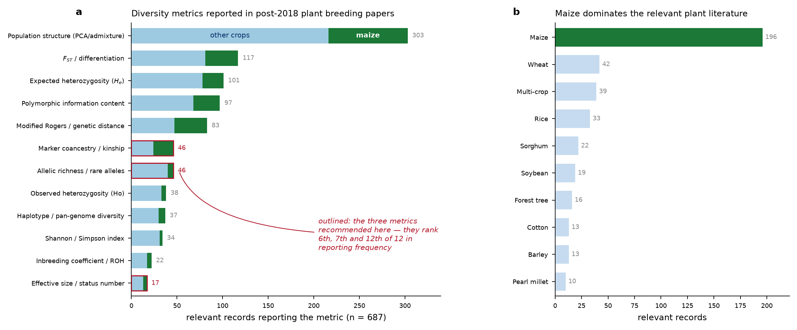

```{r setup, include=FALSE}
knitr::opts_chunk$set(echo = FALSE, message = FALSE, warning = FALSE)
library(knitr)
mu  <- read.csv("plant_metric_usage.csv", row.names = 1)
bib <- read.csv("bibliography_plant.csv")
```

# Scope and what changed {-}

The first pass of this project screened 1,770 records and returned a corpus dominated by animal
breeding: only **15 maize records** survived screening. The vocabulary was the cause — queries
built on optimal-contribution and coancestry terminology retrieve the livestock literature, because
that is the field that uses those words.

This pass ran 29 plant-specific queries (heterotic groups, modified Rogers distance, doubled
haploids, genebank cores, landrace introgression, testcross prediction) against Crossref and
Europe PMC, deduplicated against the already-screened set, and screened 2,029 new records under a
rubric split along the two questions asked: **(A)** how total diversity of a germplasm pool is
quantified from molecular data, and **(B)** how individuals are selected from that pool without
collapsing it.

**687 records scored relevant, 205 of them on maize** — a 13-fold increase in maize coverage.

```{r landscape, fig.cap="Left: which diversity metrics the 687 relevant plant-breeding records actually report. Right: crop coverage of the relevant set. Counts are records mentioning each metric; a record may report several."}

```

# The headline qualification

The companion report recommended economising to a minimal non-redundant set: $\theta$ and
$N_{e,\text{par}}$ as constraints, allelic richness at validation. That recommendation was derived
from a redundancy analysis and it stands on its own evidence. **But it is not what plant breeding
practice does, and the gap is worth stating plainly.**

```{r mutab}
m <- mu[order(-mu$n_records), c("n_records","n_maize","pct")]
names(m) <- c("records", "of which maize", "% of 687")
kable(m, caption = "Diversity metrics reported across the 687 relevant plant-breeding records.")
```

Three observations follow directly from this table:

**Applied plant work stacks metrics rather than economising.** A representative sub-Saharan
maize panel of 376 elite inbreds reports PIC = 0.39, gene diversity = 0.37, MAF = 0.29,
Shannon = 6.86, Simpson = 949.09, allelic richness = 787.70 and mean Rogers distance = 0.303 — all
in one analysis, presented as a reporting package rather than as competing alternatives. Roughly
20% of relevant records report three or more distinct metric families together.

**The metrics recommended here are among the least used.** Marker coancestry appears in 46 of 687
records (6.7%), allelic richness in 46 (6.7%), and effective size or status number in just 17
(2.5%). Meanwhile population structure analysis appears in 303 (44%) and $F_{ST}$ in 117 (17%).
The applied field is oriented toward *describing* structure, not toward *constraining* a loss.

**Nothing in the retrieved set computes $\theta$ or $N_s$ on a maize hybrid-usage vector.** The
specific formalism the companion report builds on is not established in the retrieved set. That is
a gap this project fills rather than a contradiction — but it means the approach has no published
plant-breeding baseline to be validated against.

The honest reading: for **monitoring and description**, plant practice deliberately reports many
metrics because different audiences and purposes need different views. For **constraining an
optimiser**, redundancy is a cost rather than a virtue, and the minimal set is the right choice.
These are not in conflict; they are different jobs. Report the wide package to collaborators and
in publications; constrain the DE on the narrow set.

# Quantifying total diversity of a crop pool

## What plant breeding measures, and why it differs from animal breeding

Three structural facts separate the two literatures, and they explain nearly every divergence in
metric choice:

**Lines are homozygous.** Observed heterozygosity in an inbred panel is a purity control, not a
diversity descriptor — pearl millet parental lines report $H_o = 0.031$ against $H_e = 0.334$, and
the gap is diagnostic of complete inbreeding rather than informative about the pool. Animal
coancestry theory assumes a randomly mating heterozygous population; the plant analogue computes
$\theta$ directly on fixed line genotypes, which is exactly the setting where the line-level
collapse in the companion report applies.

**The product is the F1, not the line.** Diversity is tracked separately for each parental pool and
for cross-pool complementarity — a structure with no livestock analogue. GWAS models are now built
to partition additive and dominance effects by *heterotic group of origin*.

**Diversity is managed as two objects, not one.** Within-pool and between-pool diversity trend in
opposite directions under selection and require opposite management, which no single pool-wide
statistic can express.

## Distance measures and the absence of a standard

Modified Rogers distance is the dominant distance measure in maize (36 of 83 distance-reporting
records), used chiefly for heterotic assignment and tester choice rather than for diversity
monitoring. A recent methods paper works explicitly to unify similarity and distance measures for
inbred comparison — the field still treats the choice as open.

One result is worth carrying into practice: in 298 African highland maize inbreds, **91% of line
pairs differ at 30–36% of scored alleles, yet only 32% of pairs have kinship below 0.05.** The
authors read the gap as allelic redundancy from repeated use of narrow source germplasm. A pool can
look diverse by marker counts while being genealogically shallow — a direct argument for a
coancestry-based constraint over a distance-based one.

Other calibration benchmarks from the retrieved set: North American ex-PVP dent inbreds resolve
into 8 admixture subgroups aligned with company of origin; China summer maize (490 inbreds,
525,141 SNPs) shows 66.05% of pairwise kinship values near zero; sweet corn shows systematically
lower diversity, PIC and MAF than field corn across 514 versus 181 lines.

# Heterotic groups and the structure of the maize pool

## Assignment is not a solved problem

GCA-based, SCA-based, combined (HSGCA) and SNP-distance classification are compared repeatedly with
no consistent winner. Several studies report HSGCA as most consistent with testcross performance;
others find SNP-based and testcross-based classification **disagree**. Notably, SSR markers linked
to yield QTLs give **no advantage** over random SSRs for grouping — against the intuition that
linked markers should be more predictive.

This matters for the pipeline: the line-level collapse assumes the pool structure is given. Group
assignment is itself contested, so the pool-balance constraint inherits whatever uncertainty the
assignment method carries.

## The empirical trend that justifies the constraint

The single most load-bearing empirical result in this corpus: in a commercial European dent maize
programme, **differentiation between Stiff Stalk and Non-Stiff Stalk groups increased significantly
over time while genetic diversity within both groups declined.** This is longitudinal commercial
data, not simulation.

It confirms the constraint is doing necessary work rather than solving a hypothetical problem, and
it confirms the two-object framing: the thing that erodes is within-pool diversity, and the thing
that must be protected from erosion *and* from excessive inflation is between-pool divergence.

Why divergence should be maintained rather than maximised now has a mechanistic basis: additive and
dominance QTL effects for hybrid performance are **background-specific**, depending on allelic
ancestry. Divergence pays through complementarity at specific loci, not through generic distance —
so pushing it further does not add hybrid value and risks removing shared favourable alleles.

The complication worth knowing: deliberate crossing *across* the heterotic boundary for germplasm
enhancement generated substantial usable variation, with **10.8% of hybrids from one sub-population
exceeding a high-yielding check**. The boundary is maintained for commercial hybrid-parent pools
while being selectively porous for pre-breeding.

# Selecting within the pool

## The constraint alone is not sufficient

Optimal contribution and optimal cross selection are established across crops. But a load-bearing
qualifier appears repeatedly: diversity depletion in closed elite programmes is described as
**"ineluctable"** at realistic population sizes even under active management, with bridging
populations — genetic resources crossed to elite lines before entering the elite programme — argued
as the necessary remedy.

**A $\theta$ constraint on the existing pool cannot indefinitely substitute for new germplasm.** The
pipeline should plan periodic external injections rather than treat the line pool as closed.

## Cycle length, intensity, and what goes unreported

Rapid-cycling delivers large gain-rate benefits: 12–88% relative gain advantage for oligogenic
architectures at 2–3 cycles per year versus one; cycle time cut from 2–5 years to 1 year in
intermediate wheatgrass with an explicit diversity-preserving sampling step. A maize two-cycle
genomewide selection scheme reports larger gains at equal cost and time but **no diversity metric at
all** — a gap relative to this framework. The diversity cost per unit of cycle-time reduction is not
established in the retrieved set.

Simulation work on hybrid rice reciprocal recurrent selection reports explicitly that larger
population sizes give higher gain *and* less depletion of genetic variance, and that genomic
prediction of hybrid performance plus tester updating both increase gain — diversity managed at the
parental-pool level that feeds hybrids, which is exactly the line-usage level this pipeline
constrains.

## What is hybrid-specific, and what is not

This distinction decides which literature transfers. **Every usefulness-criterion and
progeny-variance study retrieved operates upstream, at the inbred-line development stage** — cross
potential selection, UCPC for multi-parental crosses, barley validation against realised
populations, soybean family mean and variance prediction, wheat progeny-variance formulas. None
operates on F1 hybrids of fixed inbreds.

This confirms rather than challenges the decision to drop the progeny-variance term: the term is
real and actively predicted *before* fixation, and vanishes after it.

One caution that is genuinely hybrid-specific: hybrid **mean** prediction benefits materially from
additive-plus-dominance models, since dominance and SCA change predicted performance versus
additive-only GEBVs. That is a separate axis from the diversity constraint — it does not reopen the
variance term, but it means line-usage optimisation on $\theta$ should not be conflated with
mean-performance ranking of the same crosses.

The large body of heterotic-group classification work operates at parental-line classification, not
hybrid-diversity optimisation — reinforcing that $\theta$ and $N_s$ tracked on the parent-line pool
is the operative descriptor, exactly as the collapse assumes.

# Genebanks, core collections and introgression

Core-subset construction converges on a shared objective — maximise retained diversity at minimum
accession count — but diverges on method: GenoCore selecting 310 from 3,300+ sorghum accessions;
distance-based optimisation on cassava (1,486 accessions × 20,023 SNPs); rice cores of 247 and 30
from 2,242 accessions; a lettuce core of 268 from 811 capturing 99.4% of total variation.

The quantitatively strongest result: **marker-based core extraction captures 3–78-fold more
haplotypic diversity than geography- or environment-based surrogate sampling** across Arabidopsis,
Populus and sorghum panels. If cores are being assembled, assemble them on markers.

**Maize-specific core-collection algorithm choice is not established in the retrieved set** — the
maize genetic-resource work is oriented toward bridging and targeted introgression instead:

- DNA-pool genotyping of 156 landraces (2,340 individuals) against 327 elite lines spanning the
  20th century produced two indicators of a landrace's genomic contribution to elite germplasm, used
  to rank donors rather than introduce material blind.
- Haplotype mining in ~1,000 landrace-derived doubled haploids found landrace haplotypes
  **outperforming elite alternatives at the same loci**, stable across populations and environments.
- Rapid-cycling genomic selection *within* a landrace population (899 DH lines, 600K array) improves
  donor material before it contacts the elite pool.
- For capturing landrace variation, the **doubled-haploid route beats gamete capture** — higher
  prediction accuracy, and no masking of landrace variation behind a capture parent's background.

A direct $\theta$- or $N_s$-based accounting of introgression cost against a same-size resampling
baseline is not established in the retrieved set.

# Optimisation machinery reported in plants

This is where the corpus is thinnest, and it confirms the computational gap the companion report
targets:

- **Optimal contribution methods** are applied across crops, but no abstract states solver type,
  runtime, or complexity class.
- **Core-subset search** is greedy or distance-based heuristic; only input and output set sizes are
  reported, never runtime or complexity.
- **Evolutionary algorithms** appear in this corpus mainly outside plants — a dairy cattle
  breeding-programme design combining stochastic simulation with evolutionary algorithms. Within
  plants the closest analogue is a black-box numerical optimiser for progeny allocation, with no
  named algorithm, problem size, or convergence statistic.
- Problem sizes are reported as candidate-cross counts (330,078 possible barley parent combinations)
  or collection sizes, never as optimiser performance.

**No retrieved plant study applies differential evolution — or any metaheuristic — to an
OCS-type hybrid selection problem, and none reports a runtime or complexity comparison against
quadratic-programming OCS solvers.** The benchmark in the companion report has no published plant
baseline to be measured against.

# Consequences for the pipeline

1. Keep the narrow metric set inside the optimiser and report the wide package outside it. Plant
   audiences expect He, PIC, Rogers distance and structure; the DE constraint does not need them.
2. Plan for periodic germplasm injection. The literature is consistent that a closed elite pool
   depletes regardless of how well the within-pool constraint is managed.
3. Prefer bridging over direct introduction when bringing in exotic material, and rank donors by
   their genomic contribution to the elite pool rather than by raw diversity.
4. Treat the heterotic-group assignment as an uncertain input, not a fixed given — the pool-balance
   constraint is only as good as the assignment method behind it.
5. Constrain between-pool divergence within a band rather than maximising it; the value comes from
   complementarity at ancestry-specific loci, not from distance.
6. Do not conflate the diversity constraint with mean prediction. Hybrid means need
   additive-plus-dominance models; the diversity constraint needs neither.
7. Report the diversity cost per cycle explicitly when shortening cycles — the literature reports
   the gain benefit of rapid cycling far more consistently than its diversity cost.
8. If assembling a core or donor set, do it on markers rather than passport data — the retained
   haplotypic diversity differs by 3–78-fold.
9. Watch for allelic redundancy: high marker-based distance can coexist with shallow genealogy, so
   a coancestry constraint is safer than a distance-based one.
10. Validate on real genotypes before treating the redundancy result as settled — the simulation
    used $F_{ST} = 0.15$ and 6,000 markers, and the plant literature shows metric behaviour varies
    with pool structure.

# What remains unestablished

Stated strictly, from the screened abstracts:

- Application of DE or any metaheuristic to a $\theta$-constrained line-usage selection problem in
  maize — **not established in the retrieved set**.
- Runtime or complexity comparison between OCS quadratic solvers and metaheuristics for any plant
  breeding problem — **not established in the retrieved set**.
- Empirical proportional diversity loss measured against a same-size resampling baseline in an
  operating maize hybrid programme — **not established in the retrieved set**.
- Longitudinal joint reporting of allelic richness alongside $\theta$ or $N_s$ for the same hybrid
  maize programme — **not established in the retrieved set**.
- Hybrid-genome-level (rather than parental-pool-level) coancestry optimisation for F1 maize —
  **not established in the retrieved set**.
- Whether a dominance-informed term would change optimal-cross outcomes relative to the mean-only
  approach — **not established in the retrieved set**.
- Quantitative diversity cost per unit of cycle-time reduction under rapid-cycling hybrid maize —
  **not established in the retrieved set**.
- ROH-based diversity metrics applied to maize hybrid pools — **not established in the retrieved
  set** (22 records use ROH, only 5 in maize, none for hybrid diversity management).

# Corpus

```{r corpus}
kable(as.data.frame(table(bib$crop[bib$relevance == 3])[order(-table(bib$crop[bib$relevance == 3]))][1:8],
                    stringsAsFactors = FALSE),
      col.names = c("crop", "records scored 3"),
      caption = "Crop coverage of the 158 directly relevant records. Full annotated list in bibliography_plant.csv.")
```
